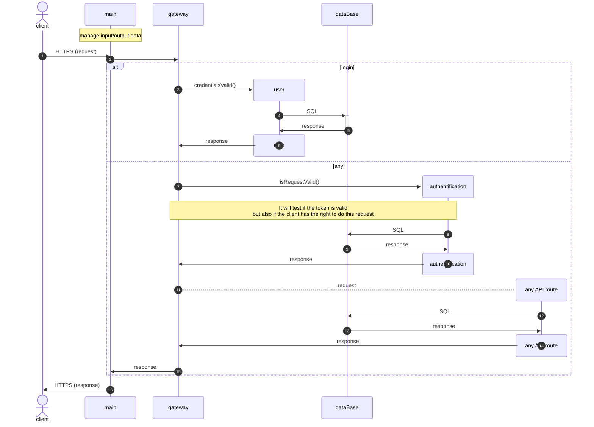

# PA24-API

## Description
\<Description needed>

## Gestion des flux



## Installation

To install the API on the disired server you need to run theses commands.

There is a `installation.sh` file that contains bash code to install and launch the API server with default configuration.

```bash
git clone https://github.com/smi4th/PA24-API.git
sudo bash PA24-API/installation.sh
```

## Configuration

You can find a `config.json` file. It contains some informations that you can modify to your liking. Like the databse location, the database credentials...

The database credentials **must** be stored in a secure way to ensure security breach.