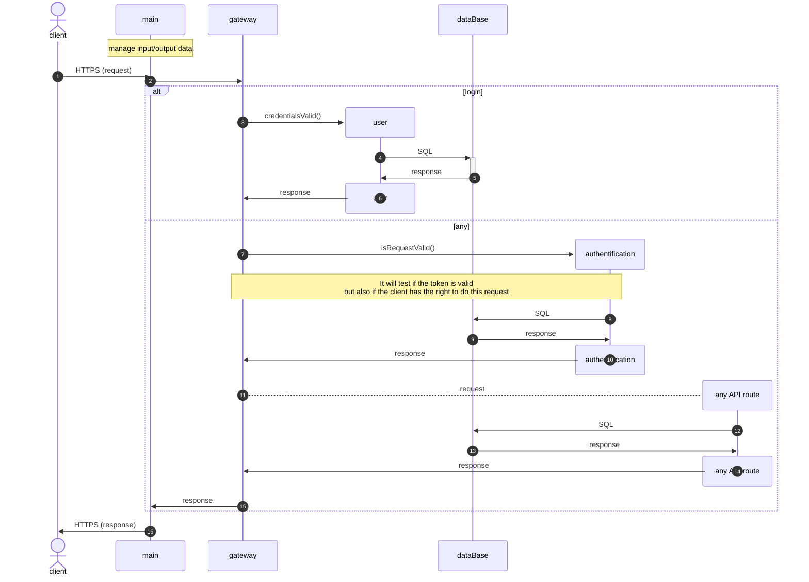

# PA24-API

# API

### Description
The API for the ParisCareTackerServices project was implemented using the Go language.


### Credentials
The API uses a classic Bearer Token system. To obtain one, simply send a `POST` API request to __`{{URI}}/api/login`__ with the following parameters in the request body:

```JSON
{
  "identifier": "<Identifier>",
  "password": "<password>"
}
```

The request will then return the Bearer token, which must be provided for all future requests.

## Flow management


## Installation
To install the API on the desired server, you need to run these commands.

There is an `installation.sh` file that contains bash code to install and launch the API server with default configuration.

```bash
git clone https://github.com/smi4th/PA24-API.git
sudo bash PA24-API/installation.sh
```

### Configuration
You can find a `config.json` file. It contains some information that you can modify to your liking. Such as the database location, the database credentials...

The database credentials must be stored securely to ensure security.

___

# Tests
Pour s'assurer du bon fonctionnement du code d'API, une suite des tests doivent êtres éxécutés avant chaque merge sur une des branches principales (`main`, `dev`).
Ses tests sont écrits en python et utilisent la bibliothèque `Pytest`.

## Ecriture d'un test (fichier Json)
Pour écrire un test il faut tout d'abord créer un fichier Json comme suit : 
```json
{
    "request": {
        "url": "API_ROUTE",
        "urlParams" : {
            "contentInURL": "valueOfURL",
            "otherURL": "valueOtherURL"
        },
        "method": "POST",
        "body": {
            "bodyValue1": "VALUE1",
            "bodyValue2": "VALUE2"
        }
    },
    "response": {
        "status_code": 201,
        "body": {
            "message": "Response Message",
            "id": "123e4567-e89b-12d3-a456-426614174000",
            "someReturnValue": "valueOfReturn"
        }
    }
}
```

Vous remarquerez qu'il est composé de 2 parties principales `request`et `response`.

### request

La partie request est directement la requête qui va être envoyé au serveur API.
Le Json ci-desus va tester de faire la requete suivante : 
```python
import requests
import json

url = "{{URI}}API_ROUTE?contentInURL=valueOfURL&otherURL=valueOtherURL"

payload = json.dumps({
  "bodyValue1": "VALUE1",
  "bodyValue2": "VALUE2"
})

response = requests.request("POST", url, data=payload)
```

Ainsi toutes les valeurs écrites dans la partie `request` seront transmises.

### response

Pour effectuer un test il faut savoir quel retour l'on est censé obtenir. Cette partie permet de tester le type de retour fait par l'API pour ce set de données envoyés.

## Configuration des tests

### URL

L'url est du serveur API est configuré dans le fichier `pytest/conftest.py`. Ainsi il ne suffit qu'a changer se fichier pour rediriger les requêtes API vers un autre serveur.

### Credentials

Dans ce fichier sont aussi encodé les crédentials pour les requêtes. Pour l'heure il n'y a pas de système de crédentials mais la fonctionnalité est déjà présente et prête.

## Ou stocker le fichier Json ?

Le fichier doit être stocker de manière très précise en cela que le nom des répertoires parents ont une grande importance dans l'éxecution des tests.

En effet, `Pytests` executera les fichiers python dont le nom commence par `test_` et ce de manière récursive, c'est à dire qu'il executera les fichiers présents dans des dossiers et des sous-dossiers.

Il les executeras dans l'ordre lexicographique, ainsi pour éviter d'effectuer les tests de suppression (`DELETE`) avant d'avoir créée la valeur (`POST`) il faut s'arranger pour que l'ordre lexicographique des fichiers soit bien le bon. 

Pour cela, il faut stocker le fichier Json dans une suite de répertoire bien précise, par exemple : 

```txt
jsonFiles/2_account/1create/test_create_09.json
```

Il s'agit là d'un vrai chemin de fichier Json. Pour le stocker correctement il faut respecter les règles suivantes : 
 
 - Le premier répertoire doit être nommée avec un chiffre, un underscore puis le nom de la table SQL.
    Si la table possède un nom avec un underscore alors les valeurs doivent êtres rassemblés.
    EX : `nom_de_table` -> `nomdetable`
    Le chiffre représente dans quel ordre ce repertoire va être executé. Dans l'exemple plus haut, il s'agit du deuxième repertoire executé.
    <br>
 - Le second repertoire doit être nommé avec un chiffre puis le nom de l'execution selon l'acronyme `CRUD` (`create`, `read`, `update`, `delete`). Les 2 valeurs doivent cette fois-ci être collés.
    <br>
 - Vient ensuite le fichier Json en lui même, il doit être nommée avec le mot `test_` au début.
    Ensuite, un underscore puis le mot référence du `CRUD`, celui là même choisi pour le répertoire précédent.
    En dernier vient un underscore et le chiffre de ce test. Si un call API nécessite 20 tests, alors il y aura 20 fichiers tous numérotés, encore une fois l'ordre a une importance.

Si la notation du fichier est bien faite, alors le fichier python et les fonctions `Pytest` associé seront bien créées.

## Utilisatation avancée

#### UNPREDEFINED

Il est possible que certains champs soient impossible à prédire. Par exemple les champ d'`id`.
Or comment tester ce que l'on attend avec ce que l'on reçoit si l'on ne le connais pas à l'avance ?
Pour remedier à cela il est possible d'inscrire la valeur `UNPREDEFINED`.

Lorsque le script lira cette valeur, il ne la comparera pas avec le vrai retour.
```json
// jsonFiles/2_account/1create
{
    // ... début du fichier json
    "response": {
        "status_code": 201,
        "body": {
            // ... body de retour
            "id": "UNPREDEFINED", // <-- ce champ ne sera jamais testé
            // .. reste du code
        }
    }
}
```

#### RANDOMIZED

Lors des calls API il est possible de créer des entrées dans la base de donnée. Or il est possible que des entrées ayant les mêmes valeurs existent déjà et que l'API interdise deux entrées ayant les mêmes valeurs.
Pour éviter ce genre de problèmes, il existe le mot clé `RANDOMIZED` qui va généré une suite de 10 charactères alphanumériques aléatoires. Il y associera aussi à la fin la chaine de charactère `@gmail.com`, ainsi il est possible d'utiliser ce mot clé pour généré des email aléatoires.

#### INJECT

Une fois qu'un call API s'est éxecuté il faut parfois réutiliser les valeurs.

Par exemple si vous effectuer un call API pour généré un compte, vous utilisez `RANDOMIZED` pour généré une addresse email aléatoire. Puis vous souhaitez faire une recherche sur tout les comptes pour obtenirs ceux qui possède cette addresse email (un seul compte en l'occurence). Alors il vous faut la même chaine de charactère généré aléatoirement.

Pour récupéré cette chaine de charactère, il suffit d'inclure le mot `INJECT`. Le mot clé `INJECT` va chercher dans un fichier Json temporaire (`temp.json`) - créé pendant l'execution des tests - la valeur associé. Il s'agit d'un Json donc la clé pour la valeur recherché est de la forme : `nomDuFichier_nomDeLaCle`. Ainsi si l'on a ceci comme Json : 
```json
// jsonFiles/2_account/1read/
{
    "url": "account",
    "urlParams": {
        "email": "INJECT"
    },
    // ... suite du json
}
```
Ici le mot clé `INJECT` ira chercher dans le fichier `temp.json` la valeur à la clé `account_email`

#### INJECT_FOREIGN

Enfin, si une requêtte nécessite une clé étrangère alors il est possible d'utiliser le mot clé `INJECT_FOREIGN`.
Ce mot clé va chercher directment la valeur associé après `:` comme suit : 
```json
// jsonFiles/2_account/1create
{
    // ... début du fichier Json
    "body": {
        // ... autres valeurs
        "account_type": "INJECT_FOREIGN:accounttype_id"
    }
}
```

Ici le script ira directement chercher la valeur dans le fichier `temp.json` dont la clé est `accounttype_id`.

## Création des fichiers de tests

Pour crée les fichiers de tests il faut se posistionner à la racine du projet.

Executer ensuite la commande : 

```bash
python3 pytest/init.py
```

Le fichier `pytest/init.py` va automatiquement scanner et récupere la liste des fichiers Json présents dans le repertoire.

Il créera ensuite tous les fichiers `.py` nécessaire en fonction.

## Execution des tests

Pour lancer les tests il suffit de se rendre à la racine du projet et d'executer la commande : 

```bash
pytest
```

Si la commande n'est pas reconnu cela veut dire que le module `Pytest` n'est pas installer sur la machine. Executez alors les commande :

```bash
pip install -U pytest
pytest --version
```

Si la commande a bien renvoyé la version de pytest alors le package est bien installé.